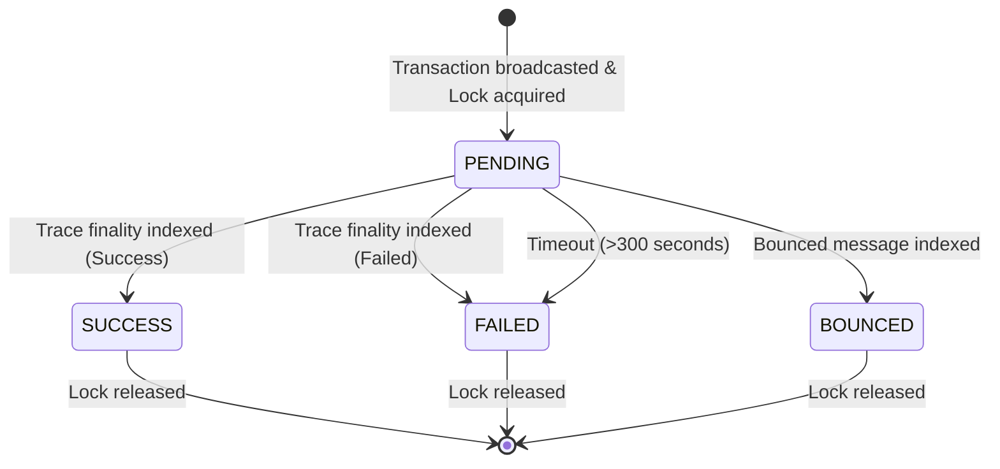

# Data Model Specification: TON Autonomous AI Agent Orchestration Framework (TAOF)

This document describes the data models and database schemas used by the off-chain runtime to manage agent state, transaction locks, and historical tracking.

---

## 1. Local Database Schema (SQLite / LibSQL)

### Table: `agentic_wallets`
Represents the delegated agent wallets deployed on-chain and their active limits.

| Field | Type | Constraints | Description |
|---|---|---|---|
| `address` | TEXT | PRIMARY KEY | On-chain contract address of the budgeting wallet |
| `delegated_public_key` | TEXT | NOT NULL | Hex-encoded public key delegated to the agent |
| `daily_limit` | TEXT | NOT NULL | Daily spending limit in nanoTONs |
| `accumulated_spend` | TEXT | NOT NULL | Total amount spent in the current 24h window |
| `last_reset_timestamp` | INTEGER | NOT NULL | Unix timestamp of the last limit reset |

### Table: `trade_transactions`
Tracks active and historical swaps initiated by the agent.

| Field | Type | Constraints | Description |
|---|---|---|---|
| `tx_hash` | TEXT | PRIMARY KEY | Transaction message hash |
| `wallet_address` | TEXT | REFERENCES `agentic_wallets(address)` | The wallet contract that executed the trade |
| `source_token` | TEXT | NOT NULL | Mint address of the token swapped from (e.g. TON) |
| `target_token` | TEXT | NOT NULL | Mint address of the token swapped to |
| `input_amount` | TEXT | NOT NULL | Amount input in nano units |
| `output_amount` | TEXT | | Amount output in nano units (null until success) |
| `status` | TEXT | NOT NULL | Status: `PENDING`, `SUCCESS`, `FAILED`, `BOUNCED` |
| `gas_fees` | TEXT | | Actual gas fees paid in nanoTON |
| `timestamp` | INTEGER | NOT NULL | Unix timestamp when the trade was broadcast |

### Table: `locks`
Used to enforce transaction-level serialization and prevent concurrent execution.

| Field | Type | Constraints | Description |
|---|---|---|---|
| `lock_name` | TEXT | PRIMARY KEY | Unique identifier for the lock (e.g., `trade_lock`) |
| `tx_hash` | TEXT | UNIQUE | The transaction hash holding the lock |
| `created_at` | INTEGER | NOT NULL | Unix timestamp when lock was acquired |

---

## 2. State Transitions (Trade Lifecycle)

- **Lock Acquisition**: Prior to generating and signing the swap message, the agent attempts to insert a record into the `locks` table. If the insert fails (due to primary key constraint), the action is rejected.
- **Lock Release**: Once the status transitions to `SUCCESS`, `FAILED`, or `BOUNCED`, or if the lock has existed for longer than 300 seconds (timeout), the database lock is deleted.
